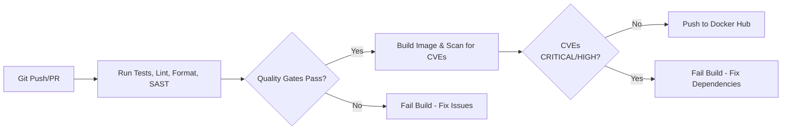

# Python App with CI/CD Pipeline

This project demonstrates a complete CI/CD pipeline using GitHub Actions for a simple Python application. It incorporates code quality checks, security scanning, and container vulnerability scanning.

## Features

- **Application:** A simple "Hello, DevOps World!" Python app.
- **Testing:** Pytest unit test.
- **Containerization:** Dockerfile for creating a container image.
- **CI/CD:** Automated GitHub Actions pipeline that includes:
  - Unit Testing with `pytest`
  - Code Linting with `pylint`
  - Code Formatting checks with `black`
  - Static Application Security Testing (SAST) with `bandit`
  - Container Vulnerability Scanning with `Trivy`
  - Automated push to Docker Hub upon success.

## 🔬 Quality & Security Gates

This pipeline enforces code quality and security best practices:

- **Unit Testing:** Pytest ensures logic correctness.
- **Code Linting:** Pylint analyzes code for potential errors and enforces a coding standard.
- **Code Formatting:** Black automatically formats the code to a consistent style. The build will fail if code is not formatted.
- **Static Application Security Testing (SAST):** Bandit scans the Python code for common security vulnerabilities.
- **Container Vulnerability Scanning:** Trivy scans the final Docker image for known CVEs (Common Vulnerabilities and Exposures) in the operating system and Python dependencies. The build will fail on critical vulnerabilities.

The pipeline is designed to fail fast, preventing insecure or low-quality code from being deployed.

## Pipeline Architecture



## How to Run Locally

1. Clone the repository:
```bash
git clone https://github.com/your_username/python-app-ci-cd.git
cd python-app-ci-cd
```

2. Install dependencies:
```bash
pip install -r requirements.txt  # if you have dependencies
pip install pytest pylint black bandit # for local checks
```

3. Run tests:
```bash
pytest -v
```

4. Check formatting:
```bash
black --check .
```

5. Run linter:
```bash
pylint app.py test_app.py
```

6. Run security scan:
```bash
bandit -r .
```

7. Build and run Docker image:
```bash
docker build -t my-python-app .
docker run my-python-app
```

## Viewing the Pipeline

The pipeline runs automatically on every push or pull request. You can view the workflow runs in the [Actions](https://github.com/your_username/python-app-ci-cd/actions) tab of this repository.

Vulnerability scan results from Trivy are uploaded to the GitHub [Security tab](https://github.com/your_username/python-app-ci-cd/security) for visibility.

## Secrets Configuration

This pipeline requires the following secrets to be set in GitHub Actions:

- `DOCKERHUB_USERNAME`: Your Docker Hub username.
- `DOCKERHUB_TOKEN`: Your Docker Hub access token.
